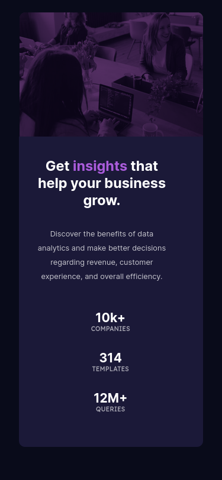

# Frontend Mentor - Stats preview card component solution

This is a solution to the [Stats preview card component challenge on Frontend Mentor](https://www.frontendmentor.io/challenges/stats-preview-card-component-8JqbgoU62). Frontend Mentor challenges help you improve your coding skills by building realistic projects. <b>My first challenge.<b>

**PT-BR**

Essa é a minha resolução do desafio *[Stats preview card component challenge on Frontend Mentor](https://www.frontendmentor.io/challenges/stats-preview-card-component-8JqbgoU62). Frontend Mentor challenges help you improve your coding skills by building realistic projects.* <b>Meu primeiro desafio realizado<b> nele eu coloco em prática todos os conhecimentos aprendindos durante o programa #TransformaTec da DIO em parceria com o Carrefour.

## Table of contents 

- [Overview](#overview)
  - [The challenge](#the-challenge)
  - [Screenshot](#screenshot)
  - [Links](#links)
- [My process](#my-process)
  - [Built with](#built-with)
  - [What I learned](#what-i-learned)
  - [Continued development](#continued-development)
  - [Useful resources](#useful-resources)
- [Author](#author)
- [Acknowledgments](#acknowledgments)

## Overview

### The challenge

I decided to put into practice my knowledge acquired at #TransformaTec.
The challenge is simple! Recreate a Landing Page.
Only HTML and CSS were used in the resolution.

**PT-BR**

Colocando em pratica meus conhecimentos adquiridos no #TransformaTec.
O desafio é simples! Recriar uma Landing Page. 
Apenas HTML e CSS foram utilizados na resolução.

### Screenshot

### Links

- Solution URL: [My Repository](https://github.com/fagundesraphael/FrontEndMentor)
- Live Site URL: [Live Site](https://fagundesraphael.github.io/FrontEndMentor/)

## My process

### Built with

- Semantic HTML5 markup
- CSS custom properties
- Flexbox
- Mobile-Version

### Useful resources

- [Origamid FlexBox Guide PT-BR](https://origamid.com/projetos/flexbox-guia-completo/) - This helped alot with FlexBox.
- [Mozilla Developer](https://developer.mozilla.org/pt-BR/) - My favorite reference for HTML and CSS.

## Author

- Github - [fagundesraphael](https://github.com/fagundesraphael)
- Frontend Mentor - [@fagundesraphael](https://www.frontendmentor.io/profile/fagundesraphael)
- Twitter - [@fagundesraphael](https://www.twitter.com/fagundesraphael)

## Acknowledgments

I would like to thank Digital Innovation One for the learning opportunity and all the teachers who are dedicated and do their best to teach us.

**PT-BR.**

Gostaria de agradecer a Digital Innovation One pela oportunidade de conhecimento adquirido. Colocar em pratica todo aprendizado e ver que é possível desenvolver coisas incríveis faz o processo se tornar ainda mais prazeroso! Como diz o professor [@Cassiano](https://github.com/cassiano-dio)<b> A tecnologia transforma vidas<b>
